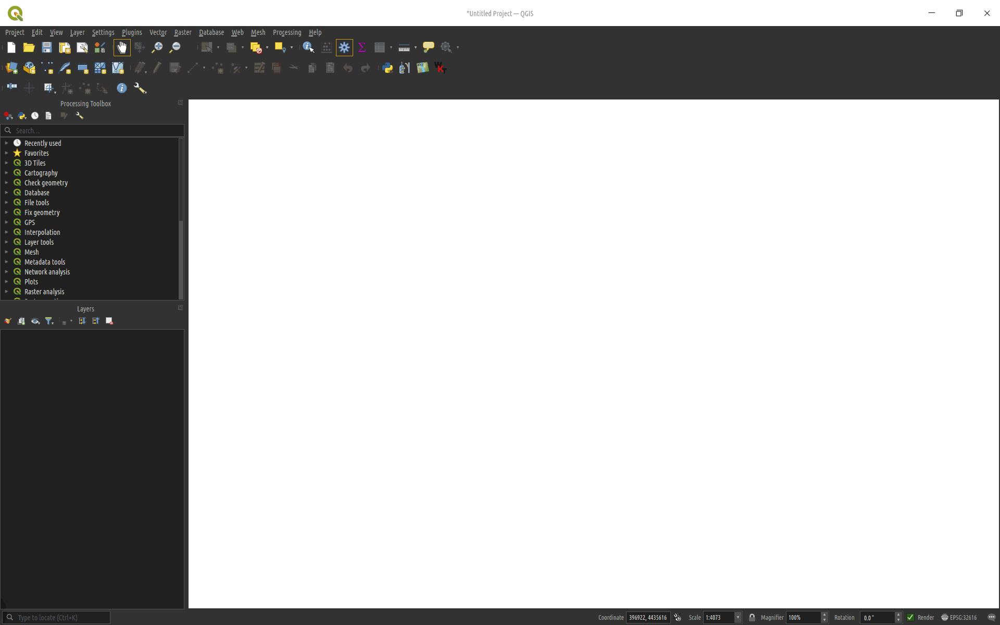

# Converting Points to Polygons

The `data/raw_points` directory contains sets of points that were collected on each farm.

There are multiple ways to turn these points into polygons, documented here.

## QGIS

The method that was used on these points to generate the polygons in `collected_polygons/` used QGIS, but the procedure is likely possible in any similar software with minor tweaks.

1. First, open QGIS and load a points layer. I started with an empty new project and dragged the file over the map to add the layer. Feel free to add a basemap if it helps.

2. The points in `data/raw_points/` are named like `{field}-{i}` where `{field}` is the field's name and `{i}` represents the index of the point in that field, starting near the NW corner and moving clockwise. This makes it fairly simple to turn these points into paths that can be used to outline polygons. 
    * To do this, I opened the 'Processing Toolbox' panel in QGIS. You can do this by right-clicking on the 'Layers' Panel and selecting 'Processing Toolbox Panel', or going to `View -> Panels -> Processing Toolbox Panel`.
    * I searched for 'Points to path' in the processing toolbox panel. Making sure that the points layer I want is selected, I opened the 'Points to Path' window.
    * In the window, make sure the 'Input layer' has the points you want and select 'Create closed paths'. Use `to_int(substr( Name,  strpos(Name, '-') + 1))` for the Order expression, and `substr(Name, 0, strpos(Name, '-') - 1)` for the 'Path group expression'. These just split the name into the index and field name parts, respectively. If your points use a different column name or point naming system, these will have to be revised for your case.
    * Click 'Run', then 'Close'. You should see a temporary 'Paths' layer and all of the points should be conected into fields. Feel free to rename the temp layer to keep track of which farm you are working on, or just make sure to delete them after use.

3. With the hardest part out of the way, select the newly created 'Paths' layer and search for the 'Lines to polygons' tool in the 'Processing Toolbox'. Open the window, make sure the 'Input layer' is the one you want, and just click 'Run'. The polygons should appear in the project window.

Order Expression:
```
to_int(substr(Name, strpos(Name, '-') + 1))
``` 
Path Group Expression:
```
substr(Name, 0, strpos(Name, '-') - 1)
```


4. From here, you can right click on 'Polygons', and `Export -> Save Features As` to save the polygons in the format of your choice. Choose the `Format` from the dropdown, and make sure that `File name` contains the full path of where you want to save the file, not sure the name (confusingly). Nothing else needs to be changed unless you want to.

> I recomend deleting the scratch layers ('Paths' and 'Polygons') before repeating this for another farm to prevent confusion. Alternatively, just name or save them if you want to keep them but prevent confusion.

## Python

You can automate the process using python, either through PyQGIS or a standalone script. Using python in QGIS, you can simply load `scripts/pyqgis_points_to_polygons.py` into QGIS, select the points layer, and run the script.



> This is possible in python without QGIS. If you want help with such a script, please contact the developer. More information can be found in the [README.md](../README.md)
